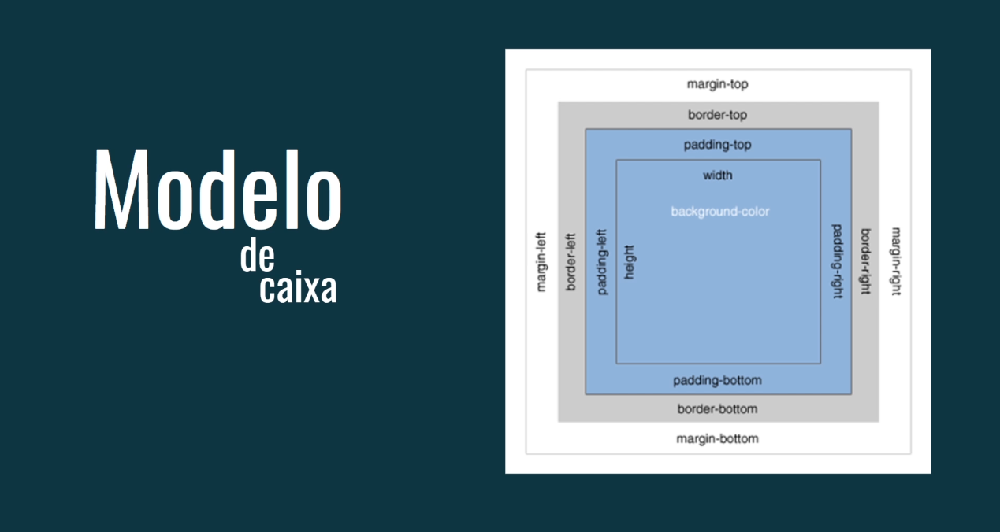
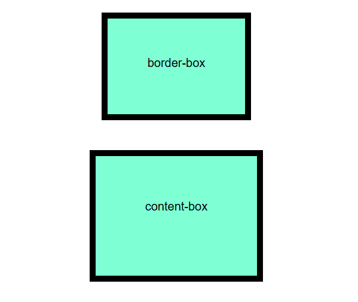

# Dominando o Box-Sizing em CSS

O `box-sizing`é uma propriedade CSS fundamental que controla como o tamanho total de um elemento é calculado, incluindo seu **conteúdo, preenchimento (padding) e borda (border)**.



## Por que usar o Box-Sizing?

Por padrão, o modelo de caixa do CSS (box model) calcula o tamanho total de um elemento adicionando o preenchimento e a borda ao tamanho definido para o conteúdo. Isso pode levar a layouts imprevisíveis, especialmente quando se trabalha com elementos aninháveis.

O `box-sizing` nos permite alterar esse comportamento para que o tamanho total do elemento seja calculado incluindo o preenchimento e a borda dentro do tamanho definido. Isso simplifica significativamente o layout e evita problemas de dimensionamento.

### Como usar Box-Sizing?

A propriedade `box-sizing` aceita dois valores principais:

- **content-box**: Este é o valor padrão. O tamanho total do elemento é calculado adicionando o preenchimento e a borda ao tamanho definido para o conteúdo.
- **border-box**: Neste caso, o tamanho total do elemento é fixo, incluindo o preenchimento e a borda. O tamanho do conteúdo é ajustado para caber dentro do tamanho total definido.

### Exemplo:

```
HTML

<div class="container1">
    <p>border-box</p>
</div>
<div class="container2">
    <p>content-box</p>
</div>
```
```
CSS

div {
border: 10px solid black;
    padding: 10px;
    width: 250px;
    height: 180px;
    margin: 50px auto;
    background-color: aquamarine;
}
.container1 {
    box-sizing: border-box;
}
.container2 {
    box-sizing: content-box;
}
```



Neste exemplo, as 2 divs tiveram um tamanho total de 250px x 180px, e foi acrescentado o preenchimento (`padding`) de 10px e a borda de 10px a ambas. 

## Aplicando Box-Sizing Globalmente:

Para aplicar `box-sizing`: border-boxa todos os elementos de sua página, você pode definir um estilo global em seu CSS:

```
* {
    box-sizing: border-box;
}
```

Isso garante que todos os elementos de sua página sejam dimensionados de acordo com o modelo de caixa `border-box`, simplificando o layout e evitando problemas de dimensionamento.

### Conclusão:

Esta `box-sizing` é uma ferramenta poderosa para controlar o tamanho e layout dos elementos em seu projeto web. Para entender como funciona e aplicá-lo corretamente, você pode criar layouts mais precisos, responsivos e simples de manter.

### [Menu Introdução ao CSS](menu_introducao-CSS.md)