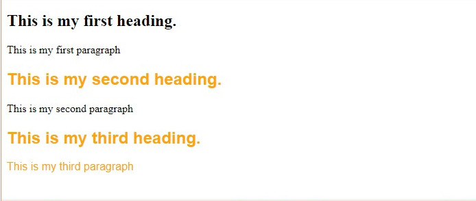
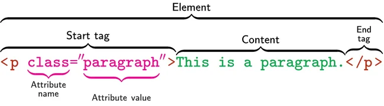

# Classes CSS e seletores .class

Imagine que você está projetando uma página da web. Você quer que um grupo de títulos tenha um texto vermelho grande, um grupo de botões tenha um texto branco médio e um grupo de parágrafos tenha um texto azul pequeno.

Escolhas ousadas. Mas, graças às classes em CSS , você pode fazer exatamente isso. As classes CSS permitem que você aplique propriedades de estilo exclusivas a grupos de elementos HTML para atingir a aparência desejada da sua página da web.

Neste post, abordaremos os termos fundamentais que você precisa saber, como classe CSS, seletor de classe e especificidade CSS. Também mostraremos como criar uma classe em CSS e usá-la para estilizar suas páginas da web.

## O que é uma classe CSS?

Uma classe CSS é um atributo usado para definir um grupo de elementos HTML a fim de aplicar estilo e formatação exclusivos a esses elementos com CSS.

Vamos dar uma olhada em um exemplo de como as classes CSS funcionam. Abaixo, temos uma página HTML simples com três títulos ( elementos `h2` ) e três parágrafos ( elementos `p` ).

Observe como o segundo título, o terceiro título e o parágrafo final são estilizados de forma diferente do restante — isso ocorre porque esses elementos receberam a classe `bright` . Olhando para o CSS, vemos o seletor .`bright` , que aplica suas regras de estilo a todos os elementos com o atributo `class="bright"` .

```
Arquivo HTML

<h2>This is my first heading.</h2>
<p>This is my first paragraph</p>
<h2 class="bright">This is my second heading.</h2>
<p>This is my second paragraph</p>
<h2 class="bright">This is my third heading.</h2>
<p class="bright">This is my third paragraph</p>
```

```
Arquivo CSS

.bright {
  color: orange;
  font-family: Arial;
}
```

O Resultado será esse 



Você pode usar classes CSS para agrupar elementos HTML e então aplicar estilos personalizados a eles. Você pode criar classes e aplicá-las a texto, botões, spans e divs , tabelas, imagens ou praticamente qualquer outro elemento de página que você possa imaginar. Vamos agora dar uma olhada mais de perto em como podemos usar classes CSS para estilizar elementos de página.

## Como criar uma classe em CSS

Vamos tentar criar uma classe CSS do zero. Digamos que você queira criar um parágrafo de texto e estilizar certas palavras para dar mais ênfase. Você pode fazer isso criando uma classe CSS para essas palavras especiais e, em seguida, atribuindo essa classe a palavras individuais com tags `span` .

Comece escrevendo os elementos HTML que você quer estilizar. Neste caso, é um parágrafo de texto:

```
<p>Our<span>marketing software</span> and 
<span>service platform</span> provide you with 
the tools you need to <span>engage</span> visitors,
<span>convert</span> them to leads, and <span>
win them over</span> as customers. </p> 
```

Também coloquei tags `<span>` ao redor das palavras que em breve estilizaremos com uma classe CSS.

Em seguida, vamos adicionar atributos de classe a essas tags `<span>` . Para fazer isso, adicione o atributo `class="name"` à tag de abertura do elemento alvo e substitua `name` por um identificador exclusivo para a classe.



No nosso exemplo, o HTML se parece com isto:

```
<p>Our <span class="orange-text">marketing software</span>
and <span class="orange-text">service platform</span> provide 
you with the tools you need to <span class="blue-text">engage</span> 
visitors, <span class="blue-text">convert</span> them to leads, and 
<span class="blue-text">win them over</span> as customers.</p> 
```

Aqui adicionamos duas classes CSS às nossas **tags span : orange-text e blue-text** .

Agora, vamos analisar algumas dúvidas que você pode ter sobre classes CSS.

### Onde você pode adicionar classes CSS em HTML?

Classes CSS podem ser adicionadas a qualquer elemento HTML. Algumas das mais comuns incluem:

- Parágrafo (`<p>`)
- Corpo (`<corpo>`)
- Título (`<title>`)
- Cabeçalhos (`<h1>, <h2>, <h3>, etc.`)
- Citações em bloco (`<blockquote>`)
- Vãos (`<span>`)
- Divisões (`<div>`)
- Imagens (``)
- Botões (`<button>`)
- Incorpora (`<embed>`)
- Ligações (`<a>`)
- Listas ordenadas e itens de lista (`<ol> e <li>, - respectivamente`)
- Listas não ordenadas e itens de lista (`<ul> e <li>, respectivamente`)
- Tabelas (`<table>`)

Simplificando, se você tiver um elemento HTML, poderá adicionar uma classe CSS.

### Quantas classes CSS você pode adicionar a um elemento?

Um dos usos mais comuns de classe em CSS é adicionar um estilo específico a um elemento específico.

Vale a pena notar? Você não está limitado a uma única classe por elemento. Considere parágrafos. Embora você possa especificar classes CSS para todos os parágrafos em sua página — como tamanho da fonte ou cor de fundo — você também pode especificar classes para parágrafos individuais para alterar sua cor ou margens, mantendo as alterações gerais de estilo intactas.

Na prática, você pode adicionar quantas classes quiser a um único elemento, mas vale a pena acompanhar o que você está alterando para garantir que você possa reverter para versões anteriores caso o resultado final não corresponda às suas expectativas.

### Qual é a diferença entre classe e ID em HTML?

A diferença entre classe e ID em HTML é que IDs são únicas — classes não são. Na prática, isso significa que múltiplos elementos em uma página podem ter a classe, enquanto elementos podem ter apenas um ID e cada página pode ter apenas um elemento com esse ID.

Considere um comentário específico em uma postagem do WordPress. Embora você possa usar a classe “item” para definir todos os comentários na mesma página, você também pode atribuir o valor WordPress gerado dinamicamente para o comentário como seu ID exclusivo.

Este é o único ID que o elemento pode ter, e não pode ser repetido em lugar nenhum da página. Usar IDs permite que você localize facilmente elementos específicos, e garantir que o mesmo ID não seja repetido em todos os elementos é essencial para que seu código HTML seja renderizado corretamente no front-end.

### [Voltar ao Menu-Principal](../README.md)