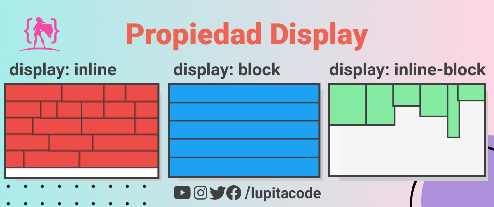

# Display

A propriedade `display` é uma das mais importantes no CSS. Ela controla **como um elemento é exibido e interage com os elementos ao seu redor**. Aqui está um overview dos tipos mais comuns de `display`.



## 1- Display Block

Quando se define `display: block` para um elemento, ele **ocupa toda a largura disponível**, formando uma nova linha. A altura e a largura do elemento podem ser controladas.

Os elementos de bloco incluem:

- `<p>`;
- `<h1> ... <h6>`;
- `<ul>`;
- `<ol>`;
- `<li>`;
- `<div>`;
- `<p>`;
- `<header>`;
- `<footer>`;
- `<section>`,
- Entre outros

```
div {
    display: block;
}
```

## 2- Display Inline

Os elementos com display: inline não começam uma nova linha. Eles ocupam apenas o espaço necessário. Você não pode definir largura e altura para elementos inline.

Exemplos de elementos inline incluem:

- `<span>`;
- `<a>`;
- `<strng>`;
- `<i>`;
- `<b>`;
- `<em>`;s
- ``;
- Entre outros.

```
span {
    display: inline;
}
```

## 3- Display Inline-Block

`inline-block` é uma combinação de `inline` e `block`. Os elementos com `display: inline-block` são **exibidos inline**, permitindo que outros elementos fiquem ao lado, mas você também pode **definir a largura e a altura**, como um elemento de bloco. Isso proporciona mais flexibilidade no layout, permitindo que você controle tanto o espaço ocupado quanto às dimensões do elemento.

```
div {
    display: inline-block;
}
```

## 4- Display None

`display: none` remove completamente o elemento da página. Ele não ocupa espaço e é como se o elemento não existisse. É diferente de `visibility: hidden`, que oculta o elemento, mas ainda reserva o espaço ocupado por ele na página.

Ao usar `display: none`, **o elemento é removido do fluxo do documento**, não afetando o layout e interações com outros elementos. Por outro lado, ao utilizar `visibility: hidden`, o elemento continua ocupando espaço, mantendo seu posicionamento relativo aos outros elementos na página, mesmo que não seja visível.

Portanto, é importante **considerar a diferença entre essas duas propriedades** ao decidir ocultar elementos em sua página.

```
div {
    display: none;
}
```

### Propriedade `visibility`

- `visibility: hidden`: Mostra ou oculta um elemento sem alterar o layout de um documento.


### [Menu Introdução ao CSS](menu_introducao-CSS.md)