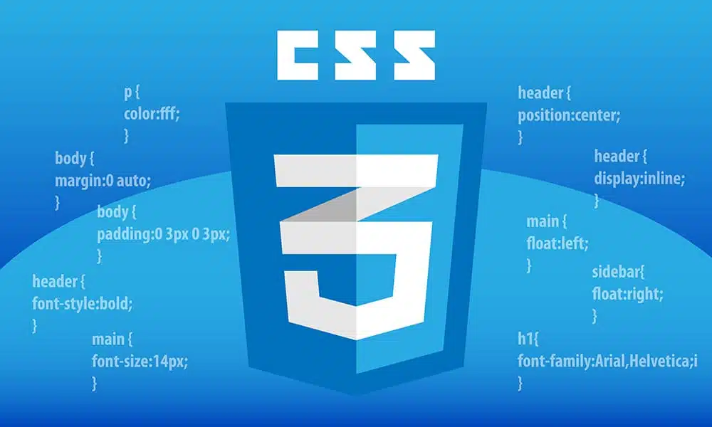

<h1 align="center" >CSS</h1>

 

## O que é CSS e sua sintaxe:

CSS (Cascading Style Sheets) é uma linguagem de estilo utilizada para descrever o visual e a apresentação de um documento HTML. A sintaxe básica do CSS consiste em um seletor seguido por um bloco de declarações, onde cada declaração é composta por uma propriedade e um valor separados por dois pontos e terminados por ponto e vírgula.

## Inclusão do CSS:

- `Modo Inline`: Utiliza o atributo style diretamente no elemento HTML.
- `Modo Interno`: Utiliza a tag `<style>` no cabeçalho do documento HTML.
- `Modo Externo`: Utiliza um arquivo CSS externo vinculado ao documento HTML com a tag `<link>`.

## Seletores de elementos:
- `TagName`: Seleciona elementos com base em suas tags HTML.
- `Class`: Seleciona elementos com base em uma classe atribuída.
- `ID`: Seleciona elementos com base em um ID único atribuído.

### Modos de Fonte:

- `Font`: Define o estilo da fonte, incluindo tamanho, família e peso
- `Font-weight`: Define a espessura da fonte.
- `Font-style`: Define o estilo da fonte (normal, itálico, obliqua).
- `Font-size`: Define o tamanho da fonte.

### Modos de Texto:

- `Text-align`: Define a alinhamento horizontal do texto.
- `Text-decoration`: Define decorações como sublinhado ou riscado.

### Cores e Propriedades:

- `RGB (Red, Green, Blue)`: Modelo de cores aditivo que combina essas três cores primárias para formar outras cores.
- `Código Hexadecimal`: Representação de cores em formato hexadecimal.
- Propriedades `Color` e `Background`: Definem as cores do texto e do fundo dos elementos, respectivamente.

### [Menu Introdução ao CSS](menu_introducao-CSS.md)

