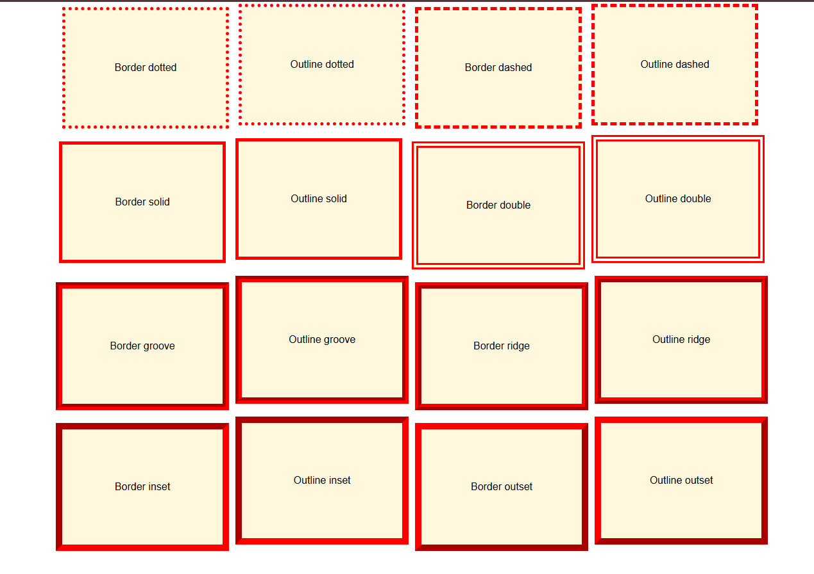

# Propriedade Outline no CSS

## O que é Outline?

O `outline`no CSS é uma propriedade que cria um contorno ao redor de um elemento. Diferentemente da borda ( `border`), o contorno não ocupa espaço no layout da página e não afeta o tamanho do elemento. Ele "flutua" sobre o elemento, como se fosse uma sombra.

### Por que usar o `Outline`?

- **Destacar elementos**: Contornos são ótimos para destacar elementos sem alterar seu layout.
- **Criar efeitos visuais**: É possível criar efeitos de foco, seleção ou erro usando contornos.
- **Acessibilidade**: Contornos podem ser usados ​​para indicar o foco de um elemento, tornando a interface mais acessível para usuários de teclado.

### Como usar a propriedade `Outline`

A propriedade `outline`é uma abreviação para as propriedades outline-width, outline-stylee outline-color.

### Sintaxe:

```
outline: width style color;
```

### Exemplo:

```
.button {
  outline: 2px solid blue;
}
```

Isso criará um contorno azul sólido de 2 pixels de largura ao redor do botão.

### Propriedades individuais:

- **largura do contorno**: Define a espessura do contorno.
- **Outline-style**: Define o estilo do contorno (sólido, pontilhado, tracejado, etc.).
- **cor do contorno**: Define a cor do contorno.

### Diferenças entre contorno e borda

|**Caracteristica**|	**Outline**|	**Border**|
|----------|---------------------|------------|
|Ocupa espaço|	Não	|Sim|
|Afeta o tamanho do elemento|	Não|	Sim|
|Posição|	Fora do elemento|	Dentro do elemento|
|Uso comum	|Foco, destaque|	Delimitação, decoração|



### Outros recursos do Outline

- **contorno-offset**: Define a distância entre o contorno e o elemento.
- **Outline-radius**: Permite criar contornos arredondados.

### Quando usar o Outline?

- **Botões**: Para indicar o foco quando um botão é clicado.
- **Links**: Para destacar links quando o mouse passa sobre eles.
- **Campos de formulário**: Para indicar o foco quando um campo está sendo editado.
- **Elementos interativos**: Para qualquer elemento que possa ser destacado visualmente.

### Dicas adicionais

- **Acessibilidade**: Use uma propriedade `outline`para criar contornos de foco que sejam visíveis para usuários de tecnologias assistivas.
- **Combinações**: Combine `outline`com outras propriedades como `box-shadow` para criar efeitos mais complexos.
- **Especificidade**: Se você precisar aplicar um estilo de contorno diferente para elementos em diferentes estados (por exemplo, `:hover`, `:focus`), use classes ou IDs para aumentar a especificidade de suas regras CSS.

**Em resumo**, o `outline`é uma ferramenta poderosa para criar interfaces mais visíveis e acessíveis. Ao entender as diferenças entre `outline`e `border` as propriedades associadas, você poderá criar efeitos personalizados e melhorar a experiência do usuário.


### [Menu Introdução ao CSS](menu_introducao-CSS.md)