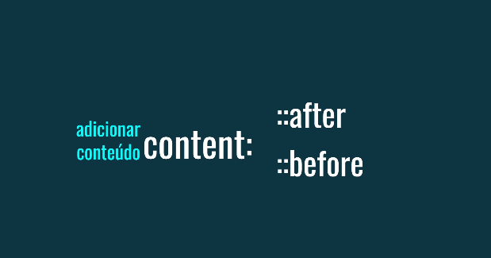

# Pseudo-elementos CSS ::after e ::before: Adicionando Conteúdo Dinâmico aos Elementos



Os pseudo-elementos **::after** e **::before** no CSS são ferramentas poderosas que permitem adicionar conteúdo ou estilos a um elemento sem a necessidade de modificação do HTML original. Eles criam pseudo-elementos, ou seja, elementos que não existem no DOM, mas que podem ser estilizados como se fossem elementos reais.

### Para que servem:

- **Adicionar conteúdo**: insira texto, ícones ou outros elementos antes ou depois do conteúdo original de um elemento.
- **Criar elementos visuais**: elementos semelhantes a linhas, triângulos ou outras formas.
- **Aplicar estilos específicos**: Adicionar estilos exclusivos a partes específicas de um elemento.

### Sintaxe:

```
selector::before {
  /* Estilos para o conteúdo antes do elemento */
}

selector::after {
  /* Estilos para o conteúdo depois do elemento */
}
```

### Exemplo:

```
<p>Este é um parágrafo.</p>
```
```
p::before {
  content: "➤ ";
  color: blue;
}

p::after {
  content: " ";
  color: green;
}
```

O resultado seria:

### ➤ Este é um parágrafo.

### Como funciona:

- **::before**: Insira o conteúdo antes do conteúdo original do elemento.
- **::after**: Insira o conteúdo depois do conteúdo original do elemento.
- **content**: Propriedade usada para definir o conteúdo a ser inserido. Pode ser texto, URLs para imagens, ou até mesmo outros elementos.
- **Outros estilos**: Você pode aplicar qualquer estilo CSS ao pseudo-elemento, como `font-size`,`color` ,`background-color` ,`position` etc.   

### Usos comuns:

- **Criar menus suspensos**: Adicionando um ícone de seta para indicar que há um menu oculto.
- **Crie elementos de navegação**: Adicionando linhas decorativas ou ícones a links.
- **Crie dicas de ferramentas**: Mostrando informações adicionais ao passar o mouse sobre um elemento.
**Criar elementos visuais**: Criando triângulos, linhas e outras formas para design.

### Importante:

```
Conteúdo gerado: O conteúdo inserido por ::before e ::after não é acessível por JavaScript ou outras linguagens de programação, pois não existe no DOM.
```
```
Acessibilidade: Certifique-se de usar esses pseudo-elementos de forma a não prejudicar a acessibilidade do seu site. Utilize atributos aria-*para fornecer informações adicionais sobre os elementos gerados.
```

### Em resumo:

As pseudo-classes **::before** e **::after** são ferramentas versáteis que permitem adicionar elementos visuais e conteúdo dinâmico aos seus elementos HTML, oferecendo mais flexibilidade e criatividade no design de suas páginas.

### [Voltar ao menu de Seletores Avançados](Menu.md)