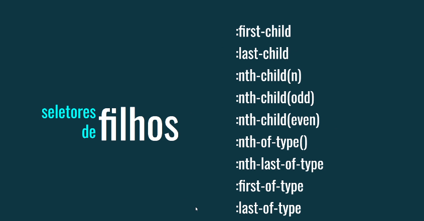
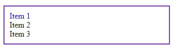
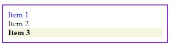
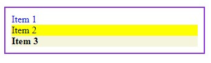
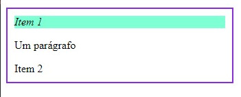
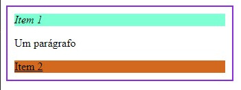
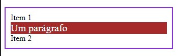
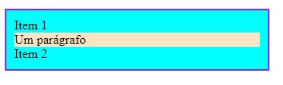
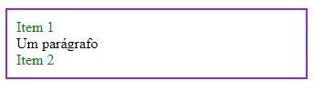

# Pseudo-classes CSS



## O que são pseudoclasses CSS?

As pseudoclasses CSS são palavras-chave adicionadas a um seletor que especifica um estado especial do elemento selecionado. Eles permitem que você aplique estilos a um elemento com base em seu estado ou posição em relação a outros elementos, sem a necessidade de adicionar classes adicionais ao HTML.

### Exemplo:

```
a:hover {
  color: red;
}
```
O código acima estiliza um link (elemento `a`) quando o mouse passa sobre ele (estado `:hover`).

## Pseudoclasses de parentesco

## :first-child

Selecionado o primeiro elemento filho de um elemento pai.

### Exemplo:

```
<ul>
  <li>Item 1</li>
  <li>Item 2</li>
  <li>Item 3</li>
</ul>
```

```
ul li:first-child {
  color: blue;
}
```



- O primeiro item da lista será azul.

## :last-child

Selecionado o último elemento filho de um elemento pai.

Exemplo:

```
ul li:last-child {
  font-weight: bold;
  background-color: beige;
}
```



- O último item da lista terá fonte em negrito e um background beige.

## :nth-child()

Selecionado o n-ésimo elemento filho de um elemento pai. O valor `n` pode ser um número inteiro positivo, negativo ou uma expressão.

### Exemplo:

```
ul li:nth-child(2) {
  background-color: yellow;
}
```



- O segundo item da lista terá fundo amarelo.

## :first-of-type

Seleciona o primeiro elemento do seu tipo entre os elementos filhos de um elemento pai.

### Exemplo:

```
<ul>
  <li>Item 1</li>
  <p>Um parágrafo</p>
  <li>Item 2</li>
</ul>
```

```
ul li:first-of-type {
  font-style: italic;
  background-color: aquamarine;
}
```



- O primeiro elemento lida lista terá estilo itálicoe um fundo aquamarine.

## :last-of-type

Selecionado o último elemento do seu tipo entre os elementos filhos de um elemento pai.

### Exemplo:

```
ul li:last-of-type {
  text-decoration: underline;
  background-color: chocolate;
}
```



- O último elemento lida lista terá sublinhado e um fundo chocolate.

## nth-of-type()

Selecionado o **n-ésimo** elemento do seu tipo entre os elementos filhos de um elemento pai. O valor `n` pode ser um número inteiro positivo, negativo ou uma expressão.

### Exemplo:

```
ul li:nth-of-type(2) {
  font-size: 20px;
  color: brown;
}
```



- O segundo elemento `li` da lista terá tamanho de fonte de 20px fundo brown.

## Valores `odd` e `even`

Se pode usar `even` e `odd` com `:nth-child` e `:nth-of-type` para selecionar elementos pares ou impares.

### Exemplo:

```
ul li:nth-child(even) {
  background-color: lightgray;
}
```



-Elementos `li` pares terão fundo cinza claro.

```
ul li:nth-of-type(odd) {
  color: green;
}
```



- Elementos `li`ímpares terão cor verde.

**Importante**: Lembre-se que a numeração começa em 1 para `:first-child`, `:first-of-type`e `:nth-child`, enquanto começa em 0 para `:nth-of-type`.

As pseudoclasses são ferramentas poderosas para estilizar elementos com base em seu estado ou posição, tornando seu CSS mais eficiente e flexível.

### [Voltar ao menu de Seletores Avançados](Menu.md)