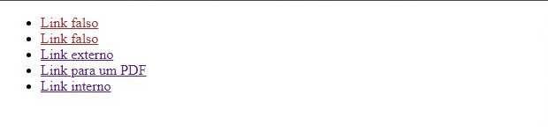
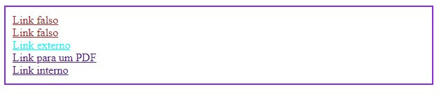
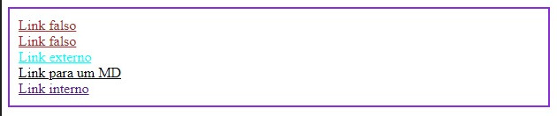

# Seletores de Atributo

Os seletores de atributos permitem que você selecione elementos com base em seus atributos HTML. Eles são especialmente úteis para estilizar elementos com classes, IDs ou outros atributos personalizados.

### Sintaxe básica:

```
elemento[atributo] {
  /* Estilos a serem aplicados */
}
```

### Exemplos:

- Selecionando todos os links com o atributo `href`:

```
a[href] {
  color: blue;
}
```

- Selecionando todos os elementos `input` com o atributo `type` igual a "texto":

### Exemplos mais avançados

```
<ul>
        <li><a href="#">Link falso</a></li>
        <li><a href="#">Link falso</a></li>
        <li><a href="https://serliv.com/" target="_blank">Link externo</a></li>
        <li><a href="seletores-compostos.md">Link para um PDF</a></li>
        <li><a href="../seletores-avancados/index.html">Link interno</a></li>
</ul>
```

```
a[href="#"] {
            color: brown;
}
```



- Selecionados todos os elementos `<a>` com o atributo `href` de valor `#`.


```
input[type="text"] {
  border: 1px solid gray;
}
```

- Selecionando todos os elementos com o atributo `class` que contém a **palavra "destaque"**:

```
div[class*="destaque"] {
  background-color: yellow;
}
```

## Operadores de comparação:

- `=`: Igual a
- `!=`: Diferente de
- `^=`: Começa com
- `$=`: Termina com
- `*=`: Contém

### Exemplos

```
<ul>
        <li><a href="#">Link falso</a></li>
        <li><a href="#">Link falso</a></li>
        <li><a href="https://serliv.com/" target="_blank">Link externo</a></li>
        <li><a href="seletores-compostos.md">Link para um MD</a></li>
        <li><a href="../seletores-avancados/index.html">Link interno</a></li>
</ul>
```

```
a[href^="http"] {
            color: aqua;
}
</sty
```



- Todos os elementos em que o **valor** começarem `^` com `http` receberam o `color: aqua`.

```
<ul>
        <li><a href="#">Link falso</a></li>
        <li><a href="#">Link falso</a></li>
        <li><a href="https://serliv.com/" target="_blank">Link externo</a></li>
        <li><a href="seletores-compostos.md">Link para um MD</a></li>
        <li><a href="../seletores-avancados/index.html">Link interno</a></li>
</ul>
```

```
a[href$=".md"] {
            color: black;
}
```



- Todos os elementos em que o valor do elemento terminarem `$` com `.md`, receberam a `color: black`


## Pseudo-classe `:not()`

A pseudo-classe `:not()`permite que você selecione todos os elementos, exceto aqueles que correspondem a um seletor específico. É uma forma de inversor a seleção.

### Sintaxe:

```
elemento:not(seletor) {
  /* Estilos a serem aplicados */
}
```
- Selecionando todos os elementos `<p>` que não possuem a classe "destaque":

```
p:not(.destaque) {
  font-style: italic;
}
```

### Combinando Seletores de Atributo e `:not()`

Você pode combinar seleções de atributo com `:not()`para criar opções ainda mais precisas.

### Exemplo:

- **Selecionando todos os links que não possuem o atributo `target`**:

```
a:not([target]) {
  text-decoration: underline;
}
```
### Casos de Uso

**Estilização de formulários**: Aplique estilos diferentes para diferentes tipos de entradas (texto, email, etc. ).
- **Criação de layouts responsivos**: Esconder elementos em determinadas telas usando media queries e `:not()`.
- **Personalização de temas**: Crie temas personalizados com base em atributos de dados.
- **Exclusão de estilos**: Remove estilos de elementos específicos.

### [Voltar ao Menu de Seletores Avançados](Menu.md)

