# Selecionadores Compostos

**Seletores compostos** em CSS são ferramentas poderosas que nos permitem combinar diferentes seletores para especificar elementos HTML específicos de forma mais precisa. Eles são essenciais para criar estilos complexos e organizados em suas páginas da web.

## Uma pequena Introdução ao DOM

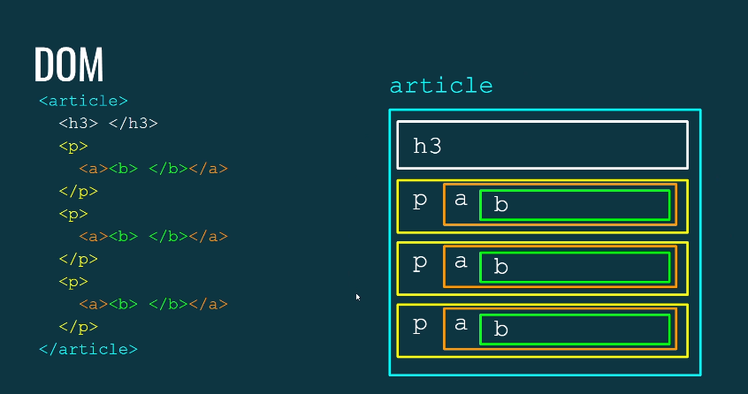

O DOM é um modelo de Objetos de Documento. Quando temos uma estrutura HTML formada, esta estrutura é representada pelo browser como uma hierarquia de informações.

Podemos fazer uma analogia a uma árvore genealógica, com elementos pai, filhos, irmãos... 

- ### Uma outra forma de representar a mesma estrutura:

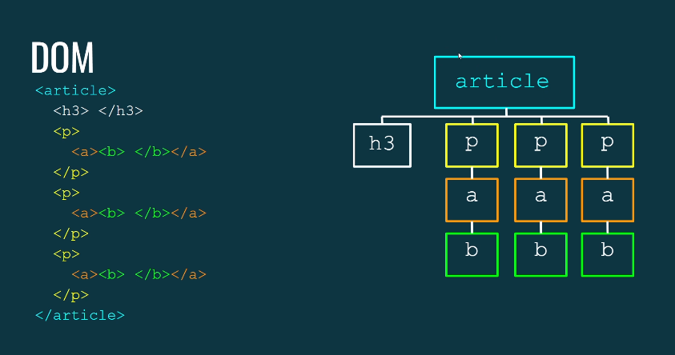

## Vamos explorar os tipos mais comuns de seleções compostas:

### 1. Seletores de Descendência

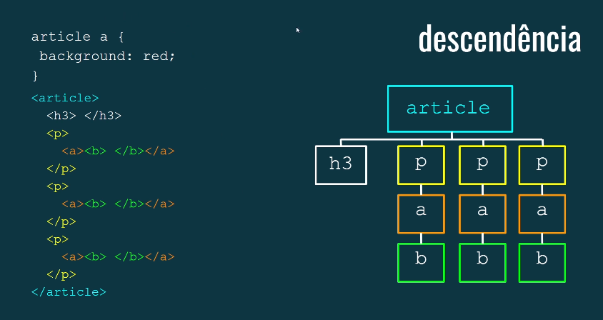

Toda vez que visualizamos um espaço entre os seletores no CSS, esse espaço significa **descendência**, ou seja o seletor CSS está contendo toda a tag de mesmo valor que está contida dentro da outra tag, independente do grau de parentesco.

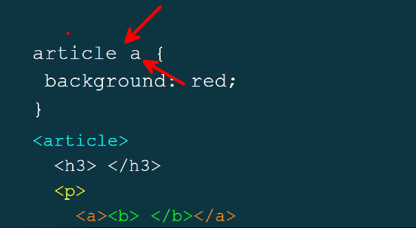

- **Sintaxe**: `elemento-pai elemento-filho`
- **Descrição**: Seleciona todos os elementos `elemento-filho`que são descendentes (diretos ou indiretos) de `elemento-pai`.

### Exemplo:

```
div p {
  color: blue;
}
```

- **Explicação**: Todas as tags `<p>`dentro de um `<div>`, em qualquer nível de aninhamento, terão cor azul.

```
<p>Parágrafo <a href="#"> link falso em <b>negrito</b></a></p>

    <article>
        <p>Parágrafo antes do título</p>

        <h3>Título</h3>

        <p>Parágrafo <a href="#"> link falso em <b>negrito</b></a></p>
        <p>Parágrafo <a href="#"> link falso em <b>negrito</b></a></p>
        <p>Parágrafo <a href="#"> link falso em <b>negrito</b></a></p>


    </article>

    <p>Parágrafo <a href="#"> link falso em <b>negrito</b></a></p>

```

```
article a {
            color: red;
}
```

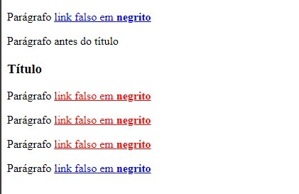

- Todos os `<a>` que estão **dentro** da tag `<article>` receberam a cor **red**

### 2. Seletores de Filho Direto

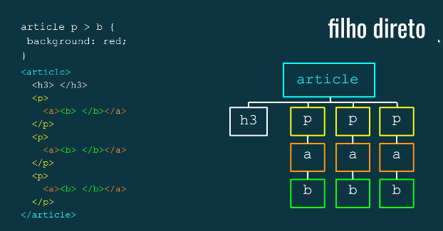

O seletor `>` seleciona todo elemento que é **filho direto** do seletor a esquerda do sinal.

- **Sintaxe**: `elemento-pai > elemento-filho`
- **Descrição**: Seleciona apenas os elementos `elemento-filho `que são **filhos diretos** de `elemento-pai`.

```
/* Exemplo: */
div > p {
  font-weight: bold;
}
```

- **Explicação**: Apenas as tags `<p>`que são filhos diretos de um `<div>` terão a fonte em negrito.

```
<p>Parágrafo <a href="#"> link falso em <b>negrito</b></a></p>

    <article>
        <p>Parágrafo antes do título <b>negrito</b></p>

        <h3>Título</h3>

        <p>Parágrafo <a href="#"> link falso em <b>negrito</b></a></p>
        <p>Parágrafo <a href="#"> link falso em <b>negrito</b></a></p>
        <p>Parágrafo <a href="#"> link falso em <b>negrito</b></a></p>


    </article>

    <p>Parágrafo <a href="#"> link falso em <b>negrito</b></a></p>

```

```
article {
            outline: 4px solid green;
            padding: 5px;
        }
        article a {
            color: red;
        }
        article a > b {
            color: green;
}
```

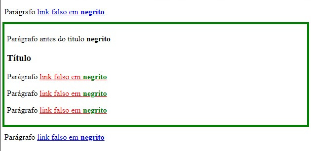

- Somente as `<b>` que são **filhos direto** do elemento `<b>` receberam a cor **green**.

### 3. Seletores de Irmão Adjacente

- **Sintaxe**: `elemento + elemento`
- **Descrição**: Seleciona **somente** o elemento que vem imediatamente após o primeiro elemento, ambos sendo filhos do mesmo pai.

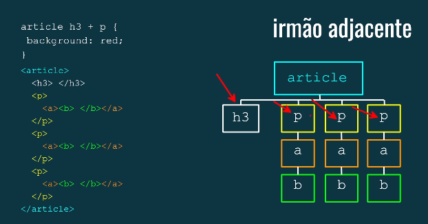

### Exemplo

```
h3 + p {
  text-indent: 2em;
}
```

- **Explicação**: O parágrafo que vem imediatamente após um título `<h3>`, ambos com o mesmo pai, terá uma devolução de 2em.

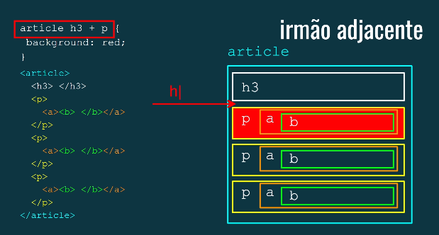

```
<p>Parágrafo <a href="#"> link falso em <b>negrito</b></a></p>

    <article>
        <p>Parágrafo antes do título <b>negrito</b></p>

        <h3>Título</h3>

        <p>Parágrafo <a href="#"> link falso em <b>negrito</b></a></p>
        <p>Parágrafo <a href="#"> link falso em <b>negrito</b></a></p>
        <p>Parágrafo <a href="#"> link falso em <b>negrito</b></a></p>


    </article>

    <p>Parágrafo <a href="#"> link falso em <b>negrito</b></a></p>

```

```
article {
            outline: 4px solid green;
            padding: 5px;
        }
        article a {
            color: red;
        }
        article a > b {
            color: green;
        }
        h3 + p {
            background-color: yellow;
}
```

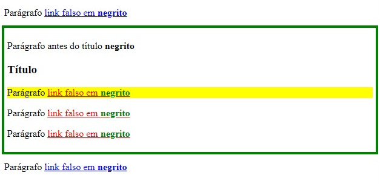

- Selecionou apenas o primeiro parágrafo, o único que é irmão direto do `h3`


### 4. Selecionadores de Irmãos Próximos

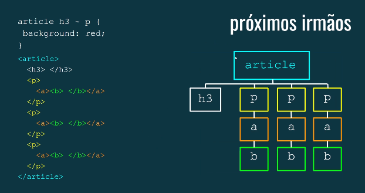

- **Sintaxe**: `elemento ~ elemento`
- **Descrição**: Seleciona **todos** os elementos que vêm após o primeiro elemento, sendo todos irmãos (mesmo pai).

```
/* Exemplo: */
h2 ~ p {
  margin-top: 10px;
}
```

- **Explicação**: Todos os parágrafos que vêm após um título `<h2>`, sendo irmãos, terão uma margem superior de 10px.

```
<p>Parágrafo <a href="#"> link falso em <b>negrito</b></a></p>

    <article>
        <p>Parágrafo antes do título <b>negrito</b></p>

        <h3>Título</h3>
        <hr>

        <p>Parágrafo <a href="#"> link falso em <b>negrito</b></a></p>
        <p>Parágrafo <a href="#"> link falso em <b>negrito</b></a></p>
        <p>Parágrafo <a href="#"> link falso em <b>negrito</b></a></p>


    </article>

<p>Parágrafo <a href="#"> link falso em <b>negrito</b></a></p>

```

```
h3 ~ hr {
            border: 4px dashed orange;
}
```

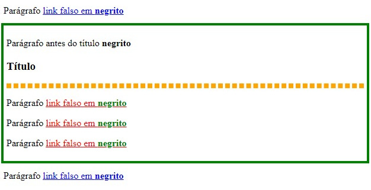

### Quando usar cada tipo?

- **Descendência**: Quando você quer aplicar um estilo a todos os elementos de um tipo dentro de um determinado contexto, independentemente do nível de aninhamento.
- **Filho Direto**: Quando você quer aplicar um estilo apenas aos elementos diretos, sem afetar os netos ou outros descendentes.
- **Irmão Adjacente**: Quando você precisa aplicar um estilo a um elemento que vem imediatamente após outro elemento específico, no mesmo nível.
- **Irmãos Próximos**: Quando você precisa aplique um estilo a todos os elementos que vêm após um elemento específico, no mesmo nível.

### Exemplo Completo

```
<div>
  <h2>Título</h2>
  <p>Parágrafo 1</p>
  <div>
    <p>Parágrafo 2</p>
  </div>
  <p>Parágrafo 3</p>
</div>
```

```
div p {
  color: blue; /* Todos os parágrafos dentro de div */
}

div > p {
  font-weight: bold; /* Apenas os parágrafos filhos diretos de div */
}

h2 + p {
  text-indent: 2em; /* Parágrafo 1 */
}

h2 ~ p {
  margin-top: 10px; /* Parágrafo 1, 2 e 3 */
}
```

### [Voltar ao menu de Seletores Avançados](Menu.md) 


