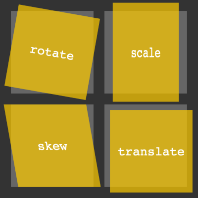
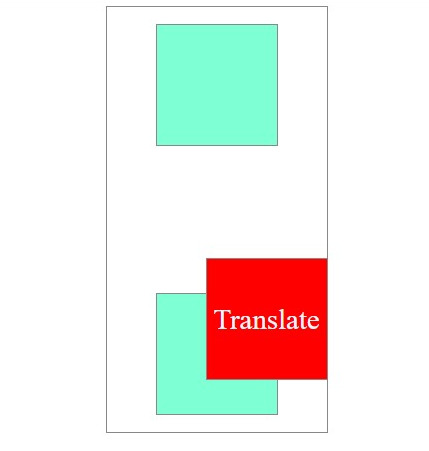
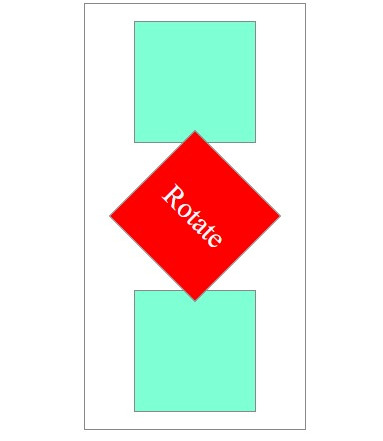
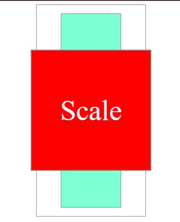
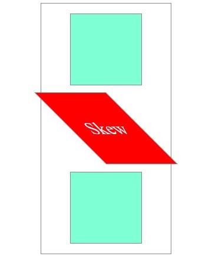
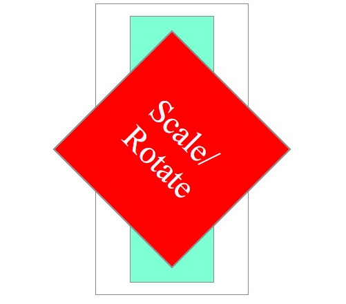
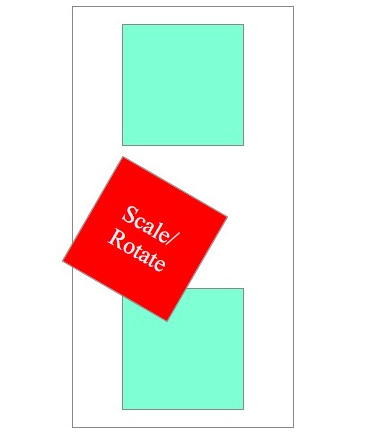

# `transform`: Moldando Elementos com Flexibilidade

A propriedade `transform`é como uma ferramenta mágica que permite **manipular visualmente** elementos HTML, alterando sua forma, tamanho e posição no espaço. Isso significa que você pode girar , escalar , inclinar e traduzir elementos sem precisar de imagens complexas ou JavaScript.  

### Os principais valores da propriedade `transform` são:



## `translate`

- Move um elemento para uma nova posição, tanto na horizontal quanto na vertical. É como pegar um elemento e arrastá-lo para outro lugar na página.

  - **Sintaxe**: A sintaxe pode ser especifica para um dos eixos x/y (`translateX` ou `translateY`), como pode ser apenas `translate(x, y)`.;
  - **Pilha**: Gera contexto de empilhamento, o elemento
  *movimentado* com o translate irá se sobre à outros elementos em contexto natural; 

- **Exemplo**:

```
<div class="div1">
        <div class="elemento1 elemento"></div>
        <div class="elemento2 elemento">
            <p>Translate</p>
        </div>
        <div class="elemento3 elemento"></div>
</div>
```

```
.elemento2 {
            transform: translate(50px, 100px);
}
```



- Move o elemento 50 pixels para a direita e 100 pixels para baixo.

## `rotate`:


- Rotaciona um elemento em torno de um ponto específico. Imagine girar um objeto em um eixo.

  - **Sintaxe**: Utilizando valores positivos, a rotação será realizada no sentido horário e, utilizando valores negativos, no sentido Anti-horário.`transform: rotate(angle)`;

- **Exemplo**:

```
.elemento2 {
            transform: rotate(45deg);
}        
```  



- Rotaciona o elemento 45 graus no sentido horário.

## `scale`

- Altera o tamanho de um elemento, aumentando ou empurrando suas dimensões. É como usar uma lupa para ampliar ou reduzir um objeto.

  - Tem como escala padrão 1. Valores maiores que 1, aumentarão o tamanho do elemento, e valores menores que 1 diminuirao sua escala.

  - **Sintaxe**: `transform: scale(x, y)`;
  
- **Exemplo**

```
.elemento2 {
    transform: scale(2);
}
```



- Aumenta o tamanho do elemento em 2 vezes na sua escala;

## `skew`

- Inclina um elemento em um ângulo específico, distorcendo sua forma. É como torcer uma imagem.

  - **Sintaxe**: `transform: skew(x-axis, y-axis)`;

- **Exemplo**

```
.elemento2 {
    transform: skew(45deg);
}
```



- Inclinação do elemento 45 graus no eixo X;

### Para que serva uma transformação de propriedade?

- **Crie efeitos visuais**: Crie animações suaves, transições e efeitos interativos para tornar seu site mais dinâmico e interessante.
- **Posicionar elementos**: Posicionar elementos de forma precisa e criativa, sem depender de tabelas ou flutuadores.
- **Criar layouts responsivos**: Adapte o layout de sua página a diferentes tamanhos de tela, utilizando as transformações para ajustar o tamanho e a posição dos elementos.

# Transformações Múltiplas com `transform`

Uma das suas maiores vantagens do `tranform` é a possibilidade de combinar múltiplas transformações em uma única declaração. Isso significa que você pode, por exemplo, usar o  `translate`, `rotate` e `scale` um elemento ao mesmo tempo.

- **Exemplo**:

```
.elemento2 {
    transform: scale(2) rotate(45deg);
}
```



- Neste exemplo o elemento aumentou sua escala em 2 e rotacionou 45 graus.

# `transform-origin`:

A propriedade `transform-origin` define o ponto de referência para as transformações. Por padrão, o ponto de referência é o centro do elemento. No entanto, você pode definir um ponto de referência diferente usando valores como `top`,` bottom` ,`left` ,`right` , porcentagens ou coordenadas exatas.  

Sintaxe:

```
element {
  transform-origin: x y;
}
```

- **Exemplo**:

```
.elemento2 {
    transform-origin: top left;
    transform: rotate(30deg);
}
```



- Neste exemplo, a rotação será feita em torno do canto superior esquerdo do elemento.