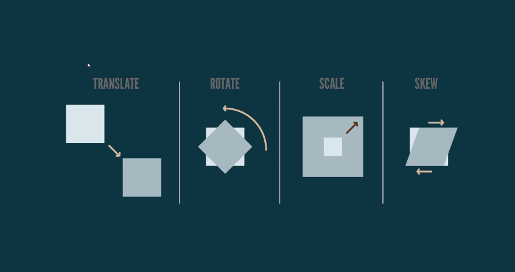

# Transform CSS

A propriedade `transform` do CSS é uma ferramenta poderosa que permite manipular elementos HTML de diversas formas, alterando sua aparência e posição sem afetar o layout da página. Vamos explorar as quatro principais funções do `transform`: `translate`, `rotate`, `scale` e `skew`.

## 1. `translate`: Movendo elementos

A função `translate` permite mover um elemento horizontalmente (eixo X) e verticalmente (eixo Y). Você pode usar valores em pixels (px), porcentagem (%), ems (em) ou outras unidades de medida CSS.

### Exemplos:

- `transform: translate(50px, 100px)`; // Move o elemento 50px para a direita e 100px para baixo.
- `transform: translate(-20%, 0)`; // Move o elemento 20% da sua largura para a esquerda.

## 2. `rotate`: Girando elementos

A função `rotate` permite girar um elemento em torno de um ponto central (por padrão, o centro do elemento). Você pode usar valores em graus (deg), radianos (rad) ou outras unidades de medida angular.

### Exemplos:

- `transform: rotate(45deg)`; // Gira o elemento 45 graus no sentido horário.
- `transform: rotate(-90deg)`; // Gira o elemento 90 graus no sentido anti-horário.

## 3. `scale`: Redimensionando elementos

A função `scale` permite aumentar ou diminuir o tamanho de um elemento. Você pode usar valores numéricos para controlar a escala nos eixos X e Y.

### Exemplos:

- `transform: scale(1.5)`; // Aumenta o tamanho do elemento em 50% em ambos os eixos.
- `transform: scale(0.5, 0.8)`; // Diminui o tamanho do elemento pela metade no eixo X e em 20% no eixo Y.

## 4. skew: Inclinando elementos

A função skew permite inclinar um elemento horizontalmente (eixo X) e verticalmente (eixo Y). Você pode usar valores em graus (deg) ou outras unidades de medida angular.

### Exemplos:

- `transform: skew(30deg)`; // Inclina o elemento 30 graus no eixo X.
- `transform: skew(0, 15deg)`; // Inclina o elemento 15 graus no eixo Y.
Combinando transformações
Você pode combinar várias funções transform em uma única declaração, separando-as por espaços. A ordem das funções é importante, pois afeta o resultado final.

### Exemplo:

- `transform: translate(50px, 100px) rotate(45deg) scale(1.2)`; // Move, gira e aumenta o elemento.
Dicas
- `Use transform-origin` para alterar o ponto central das transformações.
Experimente diferentes valores e combinações para criar efeitos interessantes.
Use transições e animações CSS para suavizar as transformações.

### [Voltar ao Menu - Transformações 2D](./menu.md)