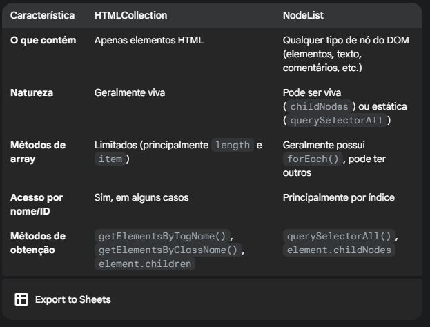

# HTMLCollection vs NodeList

## HTMLCollection:

- **O que é**: Uma `HTMLCollection` é uma coleção de elementos HTML. Ela é retornada por alguns métodos do DOM, como:

  - `document.getElementsByTagName()`
  - `document.getElementsByClassName()`
  - `element.children`

- **Natureza**: É uma coleção viva. Isso significa que se o DOM for alterado (elementos adicionados ou removidos) a coleção é automaticamente atualizada para refletir essas mudanças.

- **Acesso aos itens**: Os itens em uma `HTMLCollection` podem ser acessados por:

  - **Índice**: Como em um array (`minhaColecao[0]`).
  - **Nome ou ID (em alguns casos)**: Se os elementos tiverem atributos `name` ou `id`, você pode acessá-los usando a sintaxe de objeto (`minhaColecao['meuElemento']`).

- **Métodos e propriedades**: As `HTMLCollection` possuem algumas propriedades úteis, como `length` (para obter o número de elementos) e o método `item(index)` para acessar um elemento pelo índice. No entanto, elas não possuem métodos de array modernos como `forEach`, `map`, `filter`, etc.

## NodeList:

- **O que é**: Uma `NodeList` é uma coleção de nós do DOM. Um nó pode ser um elemento HTML, um nó de texto, um atributo, um comentário, etc. Ela é retornada por métodos como:

  - `document.querySelectorAll()`
  - `element.childNodes`

- **Natureza**: Pode ser viva ou estática, dependendo do método que a retornou:

  - `document.querySelectorAll()` retorna uma `NodeList` estática. As alterações no DOM não afetam a coleção após sua criação.
  - `element.childNodes` retorna uma `NodeList` viva. As alterações nos filhos do elemento são refletidas na coleção.

- **Acesso aos itens**: Os itens em uma `NodeList` são acessados principalmente por:

  - **Índice**: Como em um array (`minhaListaDeNodos[0]`).

- **Métodos e propriedades**: As `NodeList` também possuem a propriedade length e o método `item(index)`. A grande vantagem é que a `NodeList` retornada por `querySelectorAll()` e outras mais recentes geralmente possui o método `forEach()`, o que facilita a iteração sobre os nós. Algumas implementações mais recentes também podem incluir outros métodos de array.

### [Menu DOM parte 2](../menu.md)
