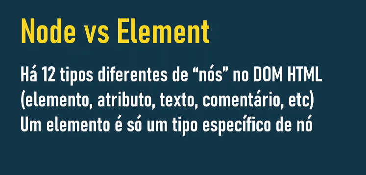
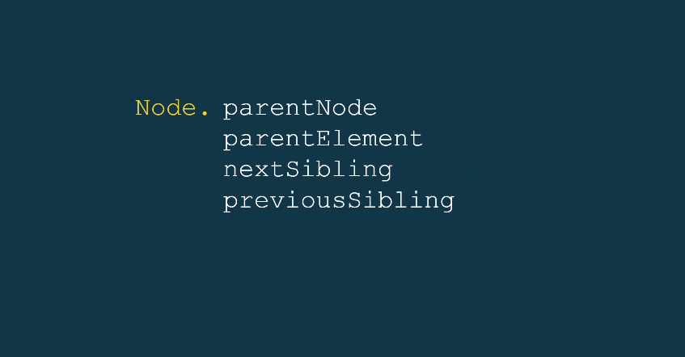
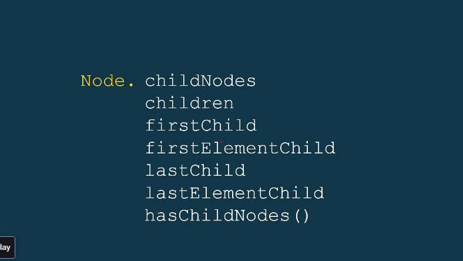
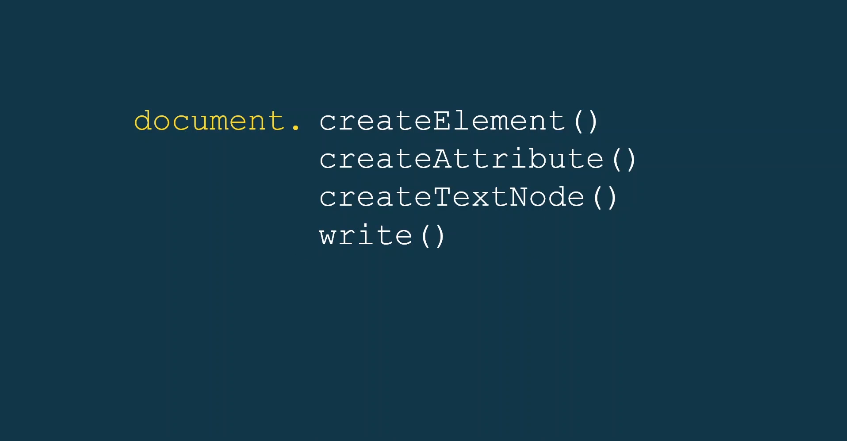
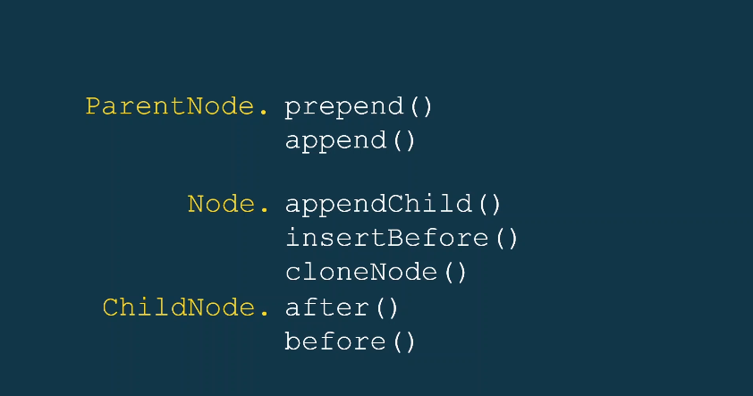
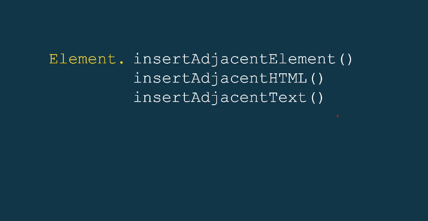
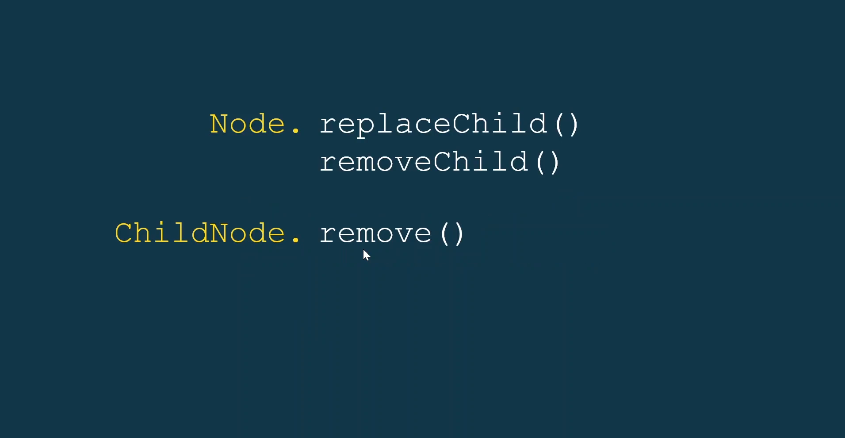

# Node Vs Elements



O HTML da sua página é como uma grande árvore, onde cada parte do seu código é um "nó" dessa árvore. Acontece que existem diferentes tipos de "nós".

## Node (Nó): O Termo Genérico

Um `Node` é o tipo mais básico de objeto na DOM. Ele representa qualquer entidade na estrutura da sua página HTML. Isso inclui:

- **Elementos HTML**: As tags que você usa para estruturar seu conteúdo (como `<div>`, `<p>`, `<span>`, `<h1>`, ``, etc.).
- **Atributos**: As características dos elementos HTML (como `class`, `id`, `src`, `href`, `alt`, etc.).
- **Texto**: O conteúdo de texto dentro dos elementos.
- **Comentários**: As partes do seu código HTML que são ignoradas pelo navegador (``).
- **O próprio documento HTML**: A raiz de toda a árvore DOM.
- E outros tipos mais específicos.

**Em resumo, um Node é qualquer ponto de conexão na árvore DOM**.

## Element (Elemento): Um Tipo Específico de Nó

Um `Element` é um **tipo específico de `Node`**. Ele representa um elemento HTML. Ou seja, as tags que você usa para construir a estrutura da sua página.

- Um `<div>` é um `Element` e também um `Node`.
- Um `<p>` é um `Element` e também um `Node`.
- Uma `` é um `Element` e também um `Node`.

**A diferença chave é que nem todo `Node` é um `Element`, mas todo `Element` é um `Node`**.

Pense assim:

- "Node" é como se fosse a categoria "coisa na árvore".
- "Element" é como se fosse a categoria "tag HTML" dentro da categoria maior de "coisa na árvore".

### Analogia:

Imagine uma árvore genealógica:

- Um "Node" seria qualquer pessoa na árvore genealógica (pais, filhos, avós, etc.).
- Um "Element" seria especificamente as pessoas que representam uma "família" (têm uma tag de família). Outras coisas na árvore (como datas de nascimento anotadas) seriam outros tipos de "Nodes" mas não "Elements".

### Por que essa distinção é importante?

Quando você está manipulando o DOM com JavaScript, você pode interagir com diferentes tipos de nós. Por exemplo:

- `element.childNodes` retorna uma `NodeList` que pode conter tanto `Elements` (os elementos HTML filhos) quanto outros tipos de nós, como nós de texto (o espaço em branco entre as tags, por exemplo).
- `element.children` retorna uma `HTMLCollection que contém apenas os Element`s filhos.
- Métodos como `document.getElementById()` ou `document.querySelector()` geralmente retornam `Element`s.

Entender essa diferença te ajuda a usar os métodos corretos do DOM e a manipular a estrutura da sua página da maneira desejada.

## Para Navegar entre os NÓS



### Para Navegar entre os NÓS (Relações Familiares):

- `parentNode`: Retorna o **nó pai** do nó atual. Se o nó não tiver pai (como o nó raiz `document`), retorna `null`. Ele pode retornar qualquer tipo de nó (Element, Text, Comment, etc.).

- `parentElement`: Retorna o **elemento pai** do nó atual. Se o nó não tiver pai ou se o pai não for um elemento HTML, retorna `null`. É mais específico que `parentNode`, pois sempre retorna um `Element`.

- `nextSibling`: Retorna o próximo nó no mesmo nível da árvore (o próximo "irmão"). Pode ser um Element, Text, Comment, etc. Se não houver próximo irmão, retorna `null`.

  - `nextElementSibling`: Retorna sempre próximo **`Element`** no mesmo nível da árvore (o próximo "irmão"). Será sempre um **Elemento**. Se não houver próximo irmão, retorna `null`.

- `previousSibling`: Retorna o nó anterior no mesmo nível da árvore (o "irmão" anterior). Pode ser um Element, Text, Comment, etc. Se não houver irmão anterior, retorna `null`.
  - `previousElementSibling`: Retorna sempre o **`element`** anterior no mesmo nível da árvore (o "irmão" anterior). Será sempre um **Elemento**. Se não houver irmão anterior, retorna `null`.



### Para Acessar os Filhos de um Nó:

- `childNodes`: Retorna uma NodeList contendo todos os nós filhos do nó atual. Isso inclui Elements, Text nodes (como espaços em branco entre tags), Comment nodes, etc. É uma coleção viva, o que significa que se os filhos do nó mudarem, a `NodeList` será automaticamente atualizada.

- `children`: Retorna uma HTMLCollection contendo apenas os elementos filhos do nó atual. Ele ignora nós de texto e comentários. Também é uma coleção viva. É geralmente mais útil quando você está interessado apenas nos elementos HTML filhos.

- `firstChild`: Retorna o primeiro nó filho do nó atual. Pode ser um Element, Text, Comment, etc. Se não houver filhos, retorna `null`.

- `firstElementChild`: Retorna o primeiro elemento filho do nó atual. Ignora nós de texto e comentários. Se não houver elementos filhos, retorna `null`.

- `lastChild`: Retorna o último nó filho do nó atual. Pode ser um Element, Text, Comment, etc. Se não houver filhos, retorna `null`.

- `lastElementChild`: Retorna o último elemento filho do nó atual. Ignora nós de texto e comentários. Se não houver elementos filhos, retorna `null`.

- `hasChildNodes()`: Retorna um valor booleano (`true` ou `false`) indicando se o nó atual possui algum nó filho (de qualquer tipo).

### Em resumo:

- Os métodos com "Element" no nome (`parentElement`, `firstElementChild`, `lastElementChild`) são convenientes quando você quer trabalhar especificamente com elementos HTML, ignorando outros tipos de nós.
- Os métodos sem "Element" (`parentNode`, `nextSibling`, `previousSibling`, `firstChild`, `lastChild`, `childNodes`) podem retornar qualquer tipo de nó presente na estrutura do DOM.
- `children` é uma coleção viva de apenas elementos filhos, enquanto `childNodes` é uma coleção viva de todos os tipos de nós filhos.

## Criar NÓS



Na imagem temos alguns métodos fundamentais para **criar novos nós na árvore DOM** (Document Object Model) com JavaScript. Vamos expandir um pouco sobre cada um deles:

### `document.createElement(tagName)`:

- **Propósito**: Cria um **novo elemento HTML** com o tagName especificado. O elemento criado ainda não está anexado à árvore DOM; ele existe apenas na memória do navegador.
- **Exemplo**:

```
const novoDiv = document.createElement('div');
const novoParagrafo = document.createElement('p');
const novaImagem = document.createElement('img');
```

- **Uso**: Depois de criar o elemento, você geralmente precisa definir seus atributos (com `setAttribute`), adicionar conteúdo (com `textContent` ou manipulando seus filhos) e, finalmente, anexá-lo a um elemento existente no DOM usando métodos como `appendChild` ou `insertBefore`.

### `document.createAttribute(name)`:

- **Propósito**: Cria um novo **nó de atributo** com o `name` especificado. Assim como os elementos criados com `createElement`, o atributo criado também não está associado a nenhum elemento até que seja explicitamente adicionado.
- **Exemplo**:

```
const classeDoDiv = document.createAttribute('class');
classeDoDiv.value = 'container';

const idDaImagem = document.createAttribute('id');
idDaImagem.value = 'logo';
```

- **Uso**: Para associar o atributo a um elemento HTML, você usa o método `element.setAttributeNode(attributeNode)`. Também é comum usar `element.setAttribute(name, value)` para criar e definir o valor do atributo em uma única etapa.

### `document.createTextNode(text)`:

- **Propósito**: Cria um **novo nó de texto** contendo o text especificado. Este nó de texto pode então ser adicionado como filho de um elemento HTML para exibir conteúdo textual na página.
- **Exemplo**:

```
const textoDoParagrafo = document.createTextNode('Este é um novo parágrafo.');
const textoDoLink = document.createTextNode('Clique aqui');
```

- **Uso**: Para adicionar o nó de texto a um elemento, você usa métodos como `element.appendChild(textNode)`.

### `document.write(html)`:

- **Propósito: Adiciona conteúdo HTML diretamente ao fluxo do documento** enquanto ele está sendo carregado.
- **Exemplo**:

```
document.write('<h1>Título inserido com document.write</h1>');
document.write('<p>Este texto também foi inserido.</p>');
```

- **Observações Importantes**:
  - O uso de `document.write()` após o carregamento inicial da página pode **sobrescrever todo o conteúdo existente**, o que geralmente não é o comportamento desejado.
  - É **geralmente desencorajado** usar `document.write()` em código JavaScript moderno, especialmente após o carregamento da página. As abordagens usando `createElement`, `createTextNode` e métodos de manipulação do DOM são mais flexíveis, eficientes e menos propensas a causar problemas.
  - `document.write()` ainda pode ser encontrado em scripts mais antigos ou em casos muito específicos, como a inserção dinâmica de scripts externos.

#### Em resumo:

- **`createElement()`**: Para criar a estrutura HTML (as tags).
- **`createAttribute()`**: Para adicionar ou modificar as características dos elementos.
- **`createTextNode()`**: Para adicionar o conteúdo de texto que será exibido.
- **`write()`**: Uma forma mais antiga e com ressalvas para adicionar HTML diretamente durante o carregamento.

## Para Adicionar NÓS



- **`ParentNode.prepend(...nodes ou strings)`**: Adiciona um ou mais `Node`s ou strings (que serão convertidas em nós de texto) no início dos filhos do `ParentNode`.

  - **Exemplo**:

```
const pai = document.getElementById('pai');
const novoH1 = document.createElement('h1');
novoH1.textContent = 'Título Adicionado no Início';
pai.prepend(novoH1);

pai.prepend('Texto no início também!');
```

- **`ParentNode.append(...nodes ou strings)`**: Adiciona um ou mais `Node`s ou strings (que serão convertidas em nós de texto) **no final** dos filhos do `ParentNode`.

  - **Exemplo**:

```
const pai = document.getElementById('pai');
const novoParagrafo = document.createElement('p');
novoParagrafo.textContent = 'Parágrafo Adicionado no Final';
pai.append(novoParagrafo);

pai.append('Mais texto no final.');
```

- **`Node.appendChild(aNode)`**: Adiciona o nó `Node` ao final da lista de filhos do `Node` ao qual o método é chamado. Se o nó já existir no documento, ele é movido para a nova posição. Retorna o nó adicionado.

  - **Observação**: `appendChild` aceita apenas um único nó como argumento.
  - **Exemplo**:

```
const pai = document.getElementById('pai');
const novoSpan = document.createElement('span');
novoSpan.textContent = 'Um novo span.';
pai.appendChild(novoSpan);
```

- **`Node.insertBefore(newNode, referenceNode)`**: Insere o `newNode` **antes** do `referenceNode` que é um filho do nó ao qual o método é chamado. Se `referenceNode` for `null`, `newNode` é adicionado ao final da lista de filhos. Retorna o nó inserido.

  - **Exemplo**:

```
const pai = document.getElementById('pai');
const primeiroFilho = pai.firstChild;
const novoStrong = document.createElement('strong');
novoStrong.textContent = 'Texto importante!';
pai.insertBefore(novoStrong, primeiroFilho);
```

- `Node.cloneNode(deep)`: Cria uma cópia do nó ao qual o método é chamado.

  - Se `deep` for `true`, todos os descendentes do nó (filhos, netos, etc.) também são clonados.
  - Se `deep` for `false` (ou omitido), apenas o próprio nó é clonado, sem seus filhos.
  - O nó clonado não é automaticamente anexado ao DOM; você precisa adicioná-lo explicitamente usando `append`, `prepend`, `appendChild` ou `insertBefore`.
  - **Exemplo**:

```
const originalP = document.getElementById('paragrafo-original');
const copiaShallow = originalP.cloneNode(); // Cópia superficial (sem filhos)
const copiaDeep = originalP.cloneNode(true); // Cópia profunda (com todos os filhos)

const pai = document.getElementById('pai');
pai.appendChild(copiaShallow);
pai.appendChild(copiaDeep);
```

## A partir do Element



### A partir do Element (Métodos mais específicos para elementos):

- `Element.insertAdjacentElement(position, element)`: Insere um `element` em uma posição específica relativa ao `Element` ao qual o método é chamado.

  - `position` pode ser:
    - `'beforebegin'`: Antes do próprio elemento.
    - `'afterbegin'`: Dentro do elemento, como o primeiro filho.
    - `'beforeend'`: Dentro do elemento, como o último filho.
    - `'afterend'`: Depois do próprio elemento.
  - ### Exemplo:

```
const meuDiv = document.getElementById('meu-div');
const novoSpan = document.createElement('span');
novoSpan.textContent = 'Span inserido!';
meuDiv.insertAdjacentElement('beforeend', novoSpan);
```

- `Element.insertAdjacentHTML(position, htmlString)`: Insere uma `htmlString` como HTML em uma posição específica relativa ao `Element`.

  - As posições são as mesmas de `insertAdjacentElement`.
  - **Observação**: Use com cuidado para evitar vulnerabilidades de segurança se a `htmlString` vier de uma fonte não confiável.
  - **Exemplo**:

```
const meuDiv = document.getElementById('meu-div');
meuDiv.insertAdjacentHTML('afterbegin', '<p class="novo">Novo parágrafo HTML</p>');
```

- `Element.insertAdjacentText(position, text)`: Insere o `text` como um nó de texto em uma posição específica relativa ao `Element`.

  - As posições são as mesmas de `insertAdjacentElement`.
  - ### Exemplo:

```
const meuDiv = document.getElementById('meu-div');
meuDiv.insertAdjacentText('beforebegin', 'Texto antes do div.');
```

## Como Remover NÓS



### `Node.removeChild(childNode)`:

- **Propósito**: Remove um nó filho (`childNode`) do nó pai (`Node`).

- **Importante**: O `childNode` precisa ser um filho direto do `Node` ao qual você está chamando o método. Se o nó não for um filho direto, um erro será lançado.

- **Retorno**: Retorna o nó removido.

- **Exemplo**:

```
const pai = document.getElementById('pai');
const filhoParaRemover = document.getElementById('filho');

if (filhoParaRemover) {
  const removido = pai.removeChild(filhoParaRemover);
  console.log('Nó removido:', removido);
}
```

### `Node.replaceChild(newChild, oldChild)`:

- **Propósito**: Substitui um nó filho existente (`oldChild`) por um novo nó (`newChild`) dentro do nó pai (`Node`).

- **Importante**: Assim como `removeChild`, `oldChild` precisa ser um filho direto de `Node`.

- **Retorno**: Retorna o nó que foi removido (`oldChild`).

- **Exemplo**:

```
const pai = document.getElementById('pai');
const filhoAntigo = document.getElementById('filho-antigo');
const filhoNovo = document.createElement('p');
filhoNovo.textContent = 'Este é o novo filho.';

if (filhoAntigo) {
  const removido = pai.replaceChild(filhoNovo, filhoAntigo);
  console.log('Nó removido:', removido);
}
```

### `ChildNode.remove()`:

- **Propósito**: Remove o próprio nó (`ChildNode`) do seu nó pai.

- **Simplicidade**: Este método é mais direto e conveniente do que `parentNode.removeChild(this)`.

- **Suporte**: É um método mais recente e tem melhor suporte nos navegadores modernos. Versões mais antigas do Internet Explorer podem não suportá-lo sem um polyfill.

- **Retorno**: Não retorna nada (`undefined`).

- **Exemplo**:

```
const elementoParaRemover = document.getElementById('elemento-remover');

if (elementoParaRemover) {
  elementoParaRemover.remove();
}
```

#### Em resumo:

- Use `removeChild()` quando você tem uma referência ao nó pai e ao nó filho que você quer remover.
- Use `replaceChild()` quando você quer substituir um nó filho existente por um novo.
- Use `remove()` quando você tem uma referência direta ao nó que você quer remover e a compatibilidade com navegadores modernos é suficiente (ou você está usando um polyfill).

**Com esses métodos, você tem as ferramentas essenciais para adicionar, remover e substituir elementos na estrutura do seu DOM dinamicamente com JavaScript! 🎉💻✨**

### [Menu DOM parte 2](../menu.md)
