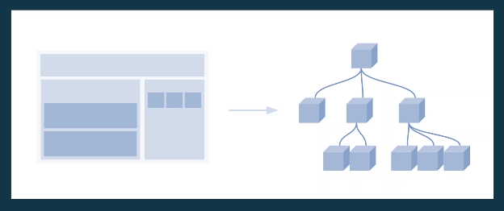

# DOM (Document Object Model)

**O DOM (Document Object Model) é uma interface de programação que representa os documentos HTML, XML e SVG como uma estrutura de árvore de objetos**. Isso significa que cada elemento da página (como um parágrafo, uma imagem ou um botão) é transformado em um objeto que pode ser acessado e manipulado por JavaScript. Essa representação permite que os desenvolvedores alterem dinamicamente o conteúdo, o estilo e a estrutura de uma página, criando interfaces web mais interativas e complexas. É como se o DOM fosse um mapa de sua página, e o JavaScript fosse uma ferramenta que você usa para navegar e fazer mudanças nesse mapa.

## Como funciona?

Vamos imaginar que esse elemento seja o `body`:

Toda vez que inserimos no HTML uma tag `body`, o que estamos fazendo na verdade é transformando esse elemento em um objeto que conseguimos manipular no JavaScript.

Note, que na primeira imagem temos 3 elementos principais, que estão representadas na segunda imagens como os 3 elementos secundários.

Em alguns elementos do HTML, também outros elementos filhos, que também estão representados na segunda imagem.

Enfim, a segunda imagem representa uma **árvore do DOM**, que é uma representação hierárquica do que temos no **HTML**.

**Em resumo**: o DOM é uma ponte entre o código HTML e o JavaScript, permitindo que você "converse" com os elementos de sua página e os modifique à vontade.

### [Voltar ao Menu DOM](./menu.md)