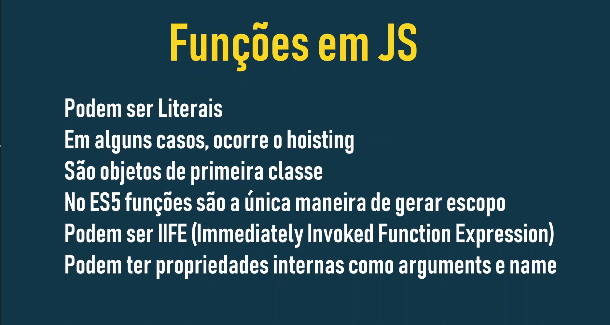
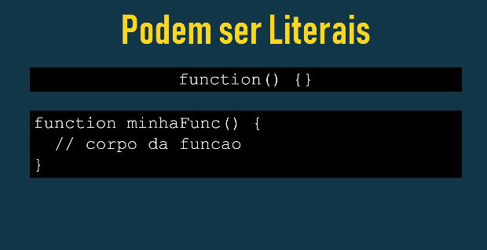
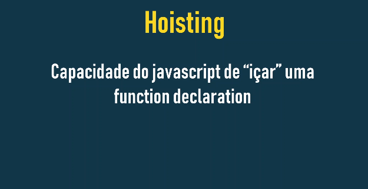

# Funções em JavaScript


Em JavaScript, funções são consideradas um tipo especial de objeto. Elas possuem propriedades e métodos assim como outros objetos.

- **Invocável**: A principal característica de uma função é sua capacidade de ser "invocada" ou "chamada". Isso significa que você pode executar o código dentro da função usando parênteses `()` após o nome da função.



## Funções em JavaScript podem ser literais



Isso significa que você pode criar uma função diretamente no código, sem a necessidade de uma declaração formal com a palavra-chave function.

### Funções Literais (Expressões de Função):

Sintaxe:

```
const minhaFuncao = function(parametro) {
    // Corpo da função
};
```

- **Atribuição a uma variável**: A função é criada e imediatamente atribuída a uma variável.
- **Uso**: A função pode ser chamada através da variável, como qualquer outra função.

### Exemplo:

```
const saudacao = function(nome) {
  console.log("Olá, " + nome + "!");
};

saudacao("Mundo"); // Saída: Olá, Mundo!
```

### Por que usar funções literárias?

- **Flexibilidade**: Podem ser atribuídas a variáveis, passadas como argumentos para outras funções ou retornadas por funções.
- **Anonimato**: Não precisa de um nome, o que pode ser útil em situações onde a função é usada apenas uma vez.
- **IIFE (Immediately Invoked Function Expressions)**: Permitem criar funções que são executadas imediatamente após a criação.

## Hoisting



### O que é Hoisting?

Hoisting, em JavaScript, é um comportamento peculiar onde as declarações de função são "içadas" para o topo do escopo no qual foram declaradas. Isso significa que você pode chamar uma função antes mesmo dela ser declarada sem código.

Como funciona:

1. **Fase de criação**: Quando o JavaScript interpreta seu código, ele passa por uma fase de criação, onde todas as declarações de variações e funções são processadas.
2. **Declarações** de funções: As declarações de funções são "içadas" para o topo do escopo, ou seja, são movidas para o início do bloco de código onde foram declaradas.
3. **Declarações de variáveis**: As declarações de variáveis ​​também são içadas, mas com um valor inicial de undefined.

### Exemplo:

```
JavaScript

console.log(minhaFuncao()); // Saída: Olá!

function minhaFuncao() {
  return "Olá!";
}
```

Mesmo que a chamada da função minhaFuncao()ocorra antes da sua declaração, o código funciona perfeitamente. Isso porque a declaração da função foi "içada" para o topo do escopo.

### Içamento e Declarações de Variáveis:

Com as declarações de variáveis, o comportamento é um pouco diferente. Se você tentar acessar uma variável antes de sua declaração, o valor será `undefined`.

```
JavaScript

console.log(x); // Saída: undefined
var x = 10;
```

### Por que o Hoisting funciona de forma diferente para funções e variáveis?

- **Funções**: As declarações de funções são tratadas como declarações completas, incluindo o corpo da função.
- **Variáveis**: As declarações de variáveis ​​são apenas declarações, e o valor é atribuído posteriormente.

### Importante:

- **Hoisting não se aplica a expressões de função**: Funções criadas usando expressões de função não são içadas.
- **O içamento pode levar a comportamentos inesperados**: Se você não entender como o içamento funciona, pode acabar escrevendo um código confuso e difícil de depurar.

### Quando usar o Hoisting?

O hoisting é um recurso do JavaScript que pode ser útil em algumas situações, mas deve ser usado com cautela. É importante entender como ele funciona para evitar erros inesperados.

### Dicas:

- **Declarar as funções no início do escopo**: Isso torna o código mais fácil de ler e entender.
- **Evite usar o içamento de forma complexa**: Um uso excessivo do içamento pode tornar o código difícil de manter.
- **Utilize o modo estrito**: No modo estrito, algumas das especializações do içamento são evitadas.

### [Voltar ao Menu Funções](menu.md)