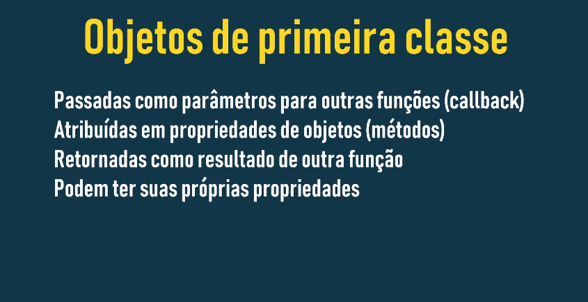

# Objetos de Primeira Classe em JavaScript: Um Guia Completo

## O que são Objetos de Primeira Classe?



Em JavaScript, funções são consideradas **cidadãos de primeira classe** ou **objetos de primeira classe**. Isso significa que elas podem ser tratadas como qualquer outro tipo de dado:

- ### Atribuídas a variáveis:

```
JavaScript

const saudacao = function() {
    console.log('Olá, mundo!');
};
```

- ### Passadas como argumentos para outras funções:

```
JavaScript

function executar(funcao) {
    funcao();
}
executar(saudacao);
```

- ### Retornadas como resultado de uma função:

```
JavaScript

function criarSaudacao(nome) {
    return function() {
        console.log(`Olá, ${nome}!`);
    };
}
const saudacaoPersonalizada = criarSaudacao('João');
saudacaoPersonalizada();
```

- ### Armazenadas em propriedades de objetos:

```
JavaScript

const pessoa = {
    nome: 'Maria',
    saudacao: function() {
        console.log(`Olá, meu nome é ${this.nome}`);
    }
};
pessoa.saudacao();
```

## Por que isso é importante?

- **Flexibilidade**: Permite criar funções dinâmicas e reutilizáveis.
- **Funcionalidade**: É a base para conceitos como funções de alta ordem, callbacks, closures e programação funcional.
- **Facilita a criação de padrões de projeto**: Como o Module Pattern e o Observer Pattern.

## Conceitos Relacionados

- **Funções de Alta Ordem**: São funções que recebem outras funções como argumentos ou retornam funções.
- **Callbacks**: São funções passadas como argumentos para outras funções, sendo executadas em um momento posterior.
- **Closures**: Uma função que se lembra de seu escopo léxico, mesmo quando executada fora desse escopo.

### Exemplo Prático: Criando um Log personalizado

```
JavaScript

function criarLog(prefixo) {
  return function(mensagem) {
    console.log(`${prefixo}: ${mensagem}`);
  };
}

const logDeErros = criarLog('ERRO');
const logDeInformacoes = criarLog('INFO');

logDeErros('Algo deu errado!');
logDeInformacoes('Operação realizada com sucesso.');
```

### Em resumo:

A natureza de primeira classe das funções em JavaScript é um dos pilares da linguagem, permitindo uma programação mais expressiva e flexível. Ao entender esses conceitos, você estará habilitado a escrever códigos mais elegantes e eficientes.

### [Voltar ao Menu Funções](menu.md)