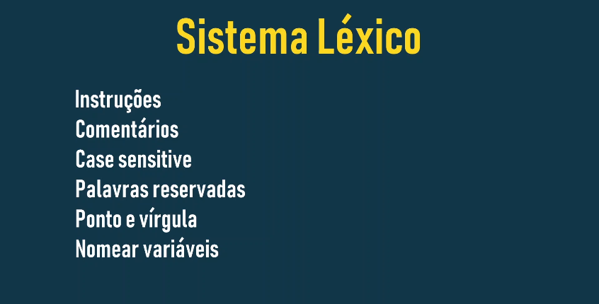
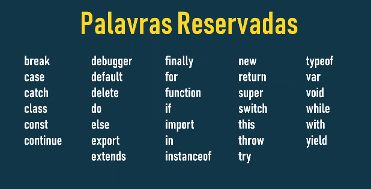
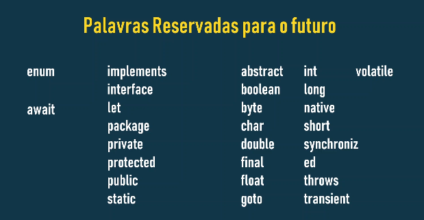

# Sistema Léxico 01



O sistema léxico do JavaScript define como regras básicas para a escrita do código, como a estrutura, os elementos básicos e os componentes que compõem a linguagem. Ele é como uma gramática do JavaScript, estabelecendo as normas que o compilador seguirá para entender e interpretar o código.

## Instruções e Estrutura Básica

- **Linhas de código**: Cada instrução em JavaScript é normalmente escrita em uma linha separada.
- **Case Sensitive**: JavaScript diferenciais de minúsculas. Por exemplo, `var`é diferente de `Var`.
- **Ponto e vírgula**: Embora não seja obrigatório em todas as situações, o ponto e vírgula (;) é geralmente usado para separar as instruções. É uma boa prática utilizá-lo para evitar erros.
- **Comentários**:
    - **De uma linha**: Iniciam com `//`. Tudo após `//` na linha é ignorado pelo interpretador.
    - **De múltiplas linhas**: Iniciam com `/*` e terminam com `*/`. Tudo entre esses delimitadores é considerado um comentário.

```
// Este é um comentário de uma linha

/*
Este é um comentário
de múltiplas linhas
*/

console.log("Hello, world!"); // Imprime "Hello, world!" no console
```

- **Palavras Reservadas**:
São palavras com significados especiais na linguagem e não podem ser usadas como nomes de variáveis ​​ou funções. Alguns exemplos:




- **Nomes de Variáveis ​​e Funções**:
    - **Iniciar com letra ou sublinhado (_)**: Não pode começar com números.
    - **Usar apenas letras, números e sublinhados**: Caracteres especiais não são permitidos.
    - **Ser descritivo**: O nome deve indicar especificamente da variável ou função.
    - **Evitar palavras reservadas**: Não usar palavras com significado especial na linguagem.

- **Sensibilidade a maiúsculas e minúsculas**
    - JavaScript diferencia maiúsculas de minúsculas, ou seja, diferenciação de letras secretas de minúsculas. Isso significa que:

        - `myVariable`é diferente de `MyVariable`.
        - `function`é diferente de `Function`.

- **O Uso do Ponto e Vírgula**:

**O ponto e vírgula (;)** é usado para separar as instruções em JavaScript. Embora não seja obrigatório em todas as situações, é altamente recomendado utilizá-lo para garantir a legibilidade e evitar erros, especialmente quando se escrevem múltiplas instruções em uma única linha.

- ### [Menu Sistema Léxico](menu.md)