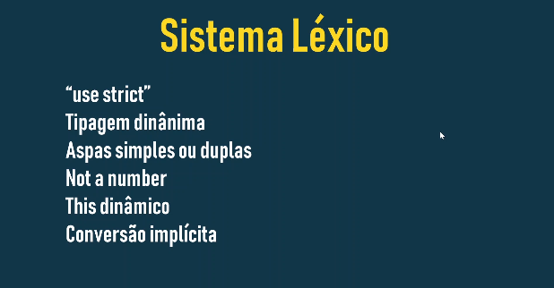

# Sistema Léxico 02



## `"use strict"`

- **O que é**: Uma cláusula que, quando colocada no início de um script ou função, ativa o modo estrito.
- **Por que usar**: O modo estrito adiciona restrições adicionais ao código, ajudando a evitar erros comuns e garantindo um código mais seguro e confiável.
- **Benefícios**:
    - Impedir a criação de variáveis ​​globais por acidente.
    - Lança erros para construções ambíguas ou não seguras.
    - Torna mais fácil otimizar o código pelo motor JavaScript.
### Exemplo:

```
'use strict';

// Código aqui estará em modo estrito
```

## Tipagem Dinâmica

- **O que é**: O JavaScript é uma linguagem de tipagem dinâmica, o que significa que o tipo de uma variável é determinado em tempo de execução, e não quando você declara uma variável.
- **Como funciona**: Você pode receber qualquer tipo de valor a uma variável, e o tipo de variável mudará automaticamente para corresponder ao valor atribuído.
### Exemplo:

```
let x = 10; // x é um número
x = "Hello"; // x agora é uma string
```

## Aspas Simples ou Duplas

- **Para que servem**: São usados ​​para delimitar strings (cadeias de caracteres) em JavaScript.
- **Como usar**: Você pode usar tanto aspas simples (') quanto aspas duplas (") para criar strings. A escolha geralmente depende da preferência pessoal ou da necessidade de incluir aspas dentro da string.
### Exemplo:

```
let nome = "João";
let frase = 'Ele disse: "Olá!"';
```

## Not a Number(NaN)

- **O que é**: Um valor especial que indica que uma operação matemática não foi realizada em um número válido.
- **Quando ocorre**: Podem ocorrer operações como dividir um número por zero ou tentar converter uma string que não representa um número para um número.
### Exemplo:

```
let resultado = "abc" / 2; // resultado será NaN
```

## `this` Dinâmico

- **O que é**: A palavra-chave `this`se refere ao objeto atual no contexto onde está sendo usado. O valor `this`pode variar dependendo de como a função é chamada.
- **Como funciona**: O valor de `this`é determinado em tempo de execução e pode mudar dependendo do contexto.
### Exemplo:

```
let pessoa = {
  nome: "Maria",
  saudar: function() {
    console.log("Olá, meu nome é " + this.nome);
  }
};

pessoa.saudar(); // Imprime: Olá, meu nome é Maria
```

## Conversão Implícita

- **O que é**: O JavaScript pode converter automaticamente um tipo de dado em outro quando necessário.
- **Quando ocorre**: As implicações implícitas ocorrem em operações matemáticas, comparações e outras situações.
### Exemplo:

```
let numero = "5";
let soma = numero + 2; // A string "5" é convertida para o número 5 antes da soma
```


- ### [Menu Sistema Léxico 01](menu.md)