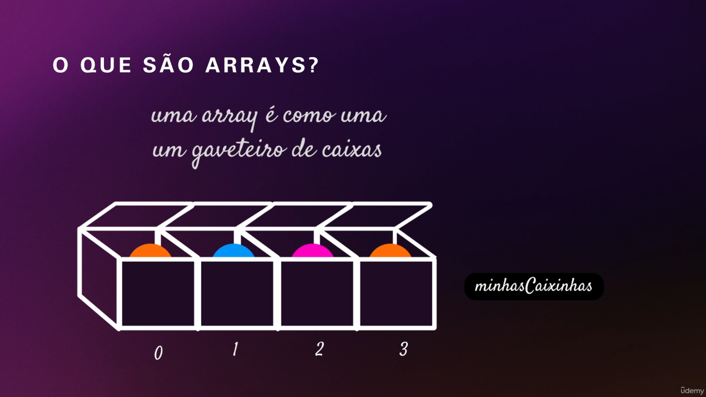

# Arrays

## O que são arrays?

São listas de valores(itens) ordenados com um nome e um índice.

Imagine que você precisa armazenar uma lista de compras. Em vez de criar uma variável para cada item, como banana, maçã, laranja você pode usar um array . Matrizes são como caixas que guardam vários valores de uma vez, facilitando a organização e o acesso a esses dados. 



## Criando um array:

### Existem duas maneiras principais de criar um array em JavaScript:

1. Usando **Sintaxe Literal**:

```
const frutas = ["banana", "maçã", "laranja"];
```

2. Usando a **Função Construtora de Array**:

```
const legumes = new Array("batata", "cenoura", "abobrinha");
```

## Acessando um item:

Para acessar um item específico dentro do array, utilizamos colchetes e o índice do item desejado. O índice começa em 0 , então:

- `frutas[0]` retorna "banana".
- `frutas[1]` retorna "maçã".
- `frutas[2]` retorna "laranja".

## Propriedade Length

- **length**: Retorna o número de elementos no array:

```
console.log(frutas.length); // 3
```

## Adicionando elemento de forma manual

A partir do nome do array mais `nomeDoArray.length` entre colchetes, as propriedades serão adicionadas no fim array.

```
let frutas = ["banana", "maçã", "laranja"]

frutas[frutas.length] = "abacaxi" // Resulta: ["banana", "maçã", "laranja", "abacaxi"]
```

## Método `push()`

- Adiciona um ou mais elementos ao final do array:

```
frutas.push("uva", "kiwi");
console.log(frutas); // ["banana", "pera", "laranja", "uva", "kiwi"]
```


### [Menu Arrays e Objetos](menu_arrays-objetos.md)