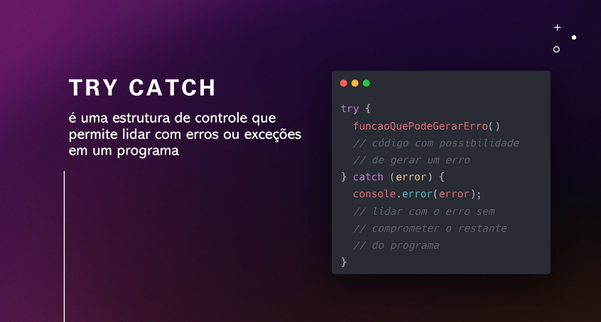
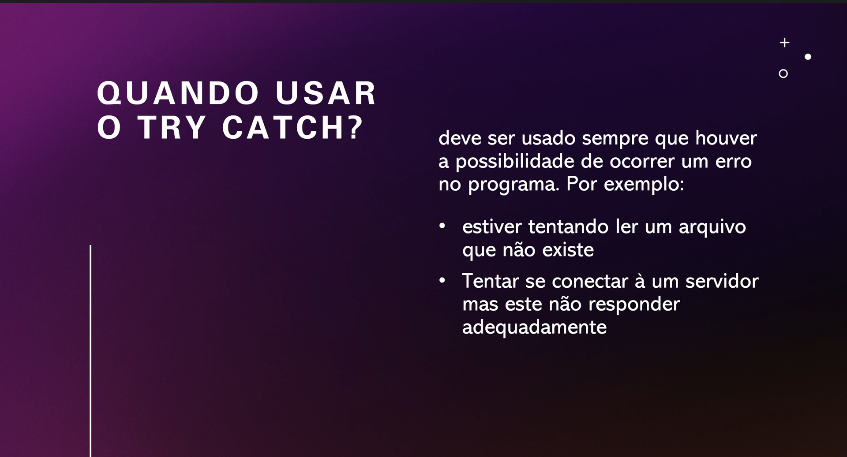

# Tratamento de Exceções em JavaScript

## O que são exceções?

Em JavaScript, abordagens são eventos que interrompem o fluxo normal de execução do código. Elas podem ocorrer por diversos motivos, como:

- **Erros de sintaxe**: quando o código não está escrito de acordo com as regras da linguagem.
- **Erros de runtime**: quando ocorre um problema durante a execução do código, como tentar acessar um elemento de um array que não existe.
- **Erros personalizados**: lançados intencionalmente pelo desenvolvedor para sinalizar condições de erro específicas.

## Por que usar o try/catch?



O bloco try/catché a principal estrutura para lidar com abordagens em JavaScript. Ele funciona da seguinte forma:

1. **try**: Envolve o código que pode gerar uma exceção.
2. **catch**: Captura a exceção lançada dentro do bloco trye permite que você execute um código específico para tratar o erro.

### Exemplo:

```
try {
  // Código que pode gerar uma exceção
  let resultado = 10 / 0;
  console.log(resultado);
} catch (error) {
  console.error("Ocorreu um erro:", error);
}
```

## Quando usar o try/catch?



- **Operações arriscadas**: Divisão por zero, acesso a elementos de matrizes inexistentes, chamadas a funções que podem falhar, etc.
- **Interação com APIs externas**: Quando você não tem controle sobre a resposta da API.
- **Validação de dados**: Para verificar se os dados de entrada não estão no formato esperado.

## Por que você não usa try/catch casualmente?

Embora `try/catch` seja uma ferramenta poderosa, usá-lo em excesso pode ter alguns impactos negativos:

- **Desempenho**: Cada bloco `try/catch` adiciona uma sobrecarga à execução do código, o que pode afetar o desempenho, especialmente em loops ou funções chamadas com frequência.
- **Complexidade**: Muitos blocos `try/catch` podem tornar o código mais difícil de ler e entender.
- **Mascaramento de erros**: Se você usar `try/catch` para capturar qualquer tipo de erro, pode acabar mascarando erros importantes que precisam ser corrigidos.

## Boas práticas para o uso de try/catch

- **Seja específico**: Capture apenas as abordagens que você espera e sabe como tratar.
- **Use finally**: O bloco `finally` é executado sempre, independentemente de uma exceção ter sido lançada ou não, e pode ser usado para liberar recursos, como fechar conexões de banco de dados.
- **Lance suas próprias abordagens**: Use a palavra-chave throwpara lançar propostas personalizadas e fornecer informações mais detalhadas sobre o erro.
- **Valide os dados de entrada: Evite passar dados inválidos para funções que possam gerar discussões.
- **Utilize bibliotecas de tratamento de erros**: Existem bibliotecas que podem ajudar a centralizar o tratamento de erros e fornecer funcionalidades adicionais, como registro e notificação.

## Exemplo com finally

```
try {
  let arquivo = abrirArquivo("dados.txt");
  // Processar o arquivo
} catch (error) {
  console.error("Erro ao abrir o arquivo:", error);
} finally {
  fecharArquivo(arquivo);
}
```

### Conclusão

O tratamento de abordagens é fundamental para criar aplicações JavaScript robustas e confiáveis. O bloco `try/catch` é uma ferramenta poderosa, mas deve ser usada com cuidado e de forma estratégica. Ao seguir as boas práticas, você pode garantir que suas aplicações lidem com erros de forma eficiente e elegante.

### [Menu Tratamento de exceções](menu.md)